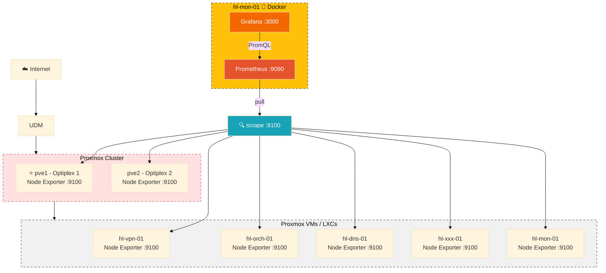

```mermaid
%%{init: {'theme':'base', 'themeVariables': {'fontSize':'16px'}}}%%
graph TD
    Internet["☁️ Internet"]
    UDM["UDM"]

    Internet --> UDM

    subgraph Proxmox["Proxmox Cluster"]
        PVE1["⭐ pve1 - Optiplex 1
        Node Exporter :9100"]
        PVE2["pve2 - Optiplex 2
        Node Exporter :9100"]
    end

    UDM --> Proxmox

    subgraph VMs["Proxmox VMs / LXCs"]
        VPN["hl-vpn-01
        Node Exporter :9100"]
        ORCH["hl-orch-01
        Node Exporter :9100"]
        DNS["hl-dns-01
        Node Exporter :9100"]
        XXX["hl-xxx-01
        Node Exporter :9100"]
        NE_MON["hl-mon-01
        Node Exporter :9100"]
    end

    Proxmox --> VMs

    SCRAPE["🔍 scrape :9100"]

    subgraph MON["hl-mon-01 🐋 Docker"]
        PROM["Prometheus :9090"]
        GRAF["Grafana :3000"]
    end

    PROM -->|pull| SCRAPE
    SCRAPE --> PVE1
    SCRAPE --> PVE2
    SCRAPE --> VPN
    SCRAPE --> ORCH
    SCRAPE --> DNS
    SCRAPE --> XXX
    SCRAPE --> NE_MON

    GRAF -->|PromQL| PROM

    style MON fill:#ffc107,stroke:#333,stroke-dasharray: 5 5
    style PROM fill:#e6522c,color:#fff
    style GRAF fill:#F46800,color:#fff
    style SCRAPE fill:#17a2b8,color:#fff
    style Proxmox fill:#ffe0e0,stroke:#dc3545,stroke-dasharray: 5 5
    style VMs fill:#f0f0f0,stroke:#333,stroke-dasharray: 5 5

```
